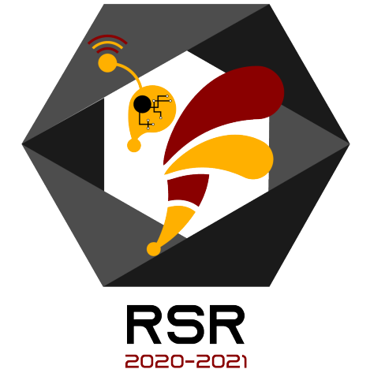

  

# Plateforme CTF

La plateforme CTF est une plateforme d'entraînement à la cybersécurité, qui contient des challenges individuels, des scénarios plus complexes et des entraînements, écrite par les étudiants de la filière RSR à l'ENSEIRB-MATMECA.

Pour contribuer au code ou aux challenges :
- [Guide de développement](docs/development.md)
- [Guide de contribution (GitLab)](CONTRIBUTING.md)
- [Machines virtuelles génériques](generics/README.md)
- [Structure des challenges](docs/challenge-structure.md)
- [Schéma de la base de données](docs/database.md)

Déploiement et administration :
- [Commandes d'administration](web/src/commands/README.md)
